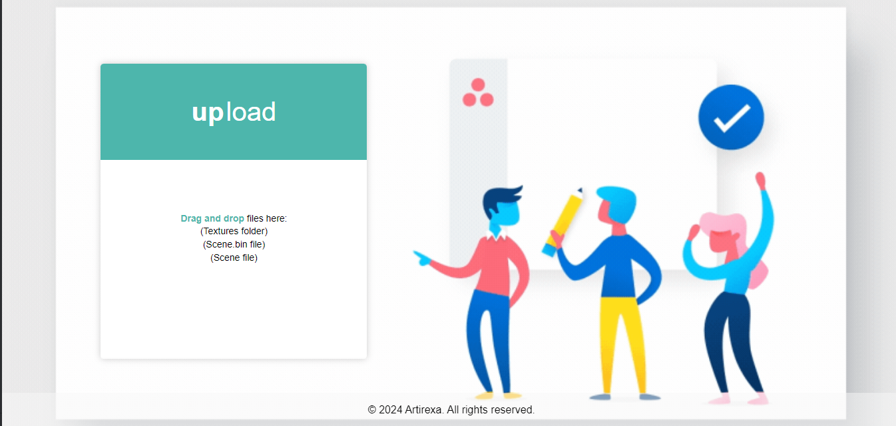

# Artirexa glTF to glb Converter

## Overview

The Artirexa glTF to glb Converter is a straightforward yet robust tool for converting glTF files into the binary glTF (glb) format. The glb format efficiently bundles all assets, including textures, into a single binary file for optimal storage and transmission.

## Features

- **Easy-to-Use:** Simplified drag-and-drop functionality for quick conversion.
- **File Bundling:** Combines glTF and associated assets into a single glb file.
- **Efficient:** Optimizes storage and transmission by packaging resources in binary form.
- **Web-Friendly:** Suitable for web applications and 3D graphics development.

## How to Use

1. Drag and drop your glTF files into the designated area.
2. The conversion process will initiate automatically.
3. The resulting glb file will be downloaded automatically.

## Screenshots

## Technologies Used

- JavaScript
- HTML
- CSS

## Usage

- Ideal for web developers and 3D graphics enthusiasts.
- Useful for optimizing glTF models for web-based applications.

## Contributing

Contributions are welcome! If you encounter issues or have feature suggestions, feel free to open an issue or submit a pull request.

## License

© 2023 Artirexa. All rights reserved.

Unauthorized use and distribution of this software, including any modification, are strictly prohibited. This project is provided for educational and personal use only. Any commercial use of this software is not allowed without the explicit written permission of the copyright owner.

For inquiries or licensing requests, please contact Ishanka Chanuka at artirexa@gmail.com.
